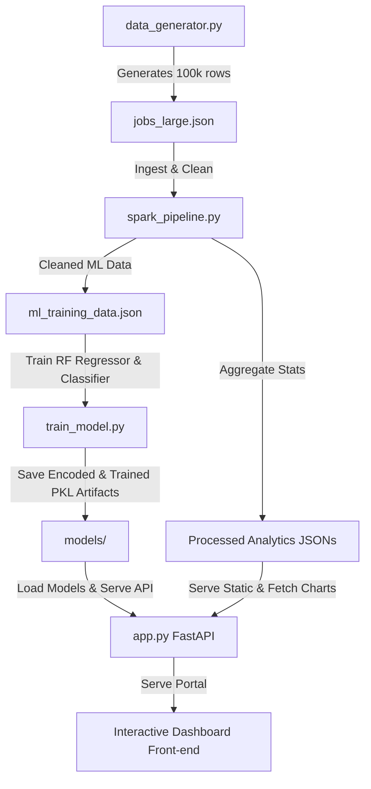

# Job Market Trend Analyzer (Big Data & Machine Learning Portal)

This project is an end-to-end Big Data and Machine Learning pipeline that generates synthetic job market data, processes and aggregates it at scale using **Apache Spark (PySpark)**, trains **Scikit-Learn Random Forest models** to predict salaries and demand, and exposes a interactive dashboard powered by a **FastAPI** backend and dynamic front-end (HTML5/CSS3/JavaScript with Chart.js).

---

## 🏗️ Architecture & Pipeline Flow

The project consists of 4 main phases:



1. **Synthetic Data Generation (`data_generator.py`)**: Generates a massive JSON dataset representing 100,000 raw job listings with titles, industries, companies, locations, experience levels, skills, premium adjustments, and custom demand categories.
2. **PySpark Big Data Pipeline (`spark_pipeline.py`)**: Launches a local Spark session to clean the data, calculate multi-dimensional aggregates (salary trends, remote ratios, skill popularity), and prepare/export the training dataset.
3. **Scikit-Learn Model Training (`train_model.py`)**: Fits one-hot encoders for categorical values, a multi-label binarizer for skill tags, and trains Random Forest models to predict salary (regression) and market demand (classification).
4. **FastAPI Web Server & UI (`app.py`)**: Hosts high-performance REST endpoints and serves the fully responsive, glassmorphic client interface.

---

## 🛠️ Prerequisites & Setup

Ensure you have the following installed on your machine:
* **Python 3.9+** (recommended)
* **Java Development Kit (JDK) 8, 11, or 17** (Required by PySpark). Ensure `JAVA_HOME` is set up in your system environment variables.

### 1. Clone & Enter Project Folder
Open your terminal and make sure you are in the project's root directory:
```bash
cd c:\Users\marya\OneDrive\Desktop\Final_Project_BIG_DATA_ANALYTICS\Final_Project
```

### 2. Create and Activate a Virtual Environment (Recommended)
```bash
# Create the environment
python -m venv venv

# Activate the environment:
# On Windows (Command Prompt):
venv\Scripts\activate.bat

# On Windows (PowerShell):
venv\Scripts\Activate.ps1

# On macOS / Linux:
source venv/bin/activate
```

### 3. Install Dependencies
Install all required libraries for the Big Data pipeline, ML models, and API server:
```bash
pip install fastapi "uvicorn[standard]" pydantic joblib pandas numpy scikit-learn pyspark
```

---

## 🚀 Running the Project

You can run the pipeline step-by-step using either the command line or VS Code's integrated debugger.

### Method A: Running via Terminal (Step-by-Step)

#### Step 1: Generate the Raw Dataset
Create 100,000 synthetic job listings. This creates `backend/data/jobs_large.json`.
```bash
python backend/data_generator.py
```

#### Step 2: Run the Apache Spark Pipeline
Run clean-up, compute analytics, and export training data. This saves files in `backend/data/processed/`.
```bash
python backend/spark_pipeline.py
```
> [!NOTE]
> If you see Hadoop/Winutils warnings on Windows, they can be safely ignored; Spark will still process the data locally in-memory.

#### Step 3: Train the Machine Learning Models
Train the Random Forest regressors/classifiers and save serialization files to `backend/models/`.
```bash
python backend/train_model.py
```

#### Step 4: Launch the Web App Server
Run the FastAPI server which also mounts and hosts the static dashboard front-end.
```bash
python -m uvicorn backend.app:app --reload
```
Once started, open your browser and navigate to:
👉 **[http://localhost:8000](http://localhost:8000)** (Interactive Portal Dashboard)  
👉 **[http://localhost:8000/docs](http://localhost:8000/docs)** (FastAPI Swagger Interactive Documentation)

---

### Method B: Running via VS Code (Recommended)

The project includes preconfigured launch configurations. Open the `Final_Project` directory in VS Code, click on the **Run and Debug** icon (`Ctrl+Shift+D` or `Cmd+Shift+D`), and run the configurations in order using the dropdown:

1. Select **`Python: Generate Data`** ➔ Click Run (Green Arrow).
2. Select **`Python: Spark Pipeline`** ➔ Click Run.
3. Select **`Python: Train Models`** ➔ Click Run.
4. Select **`FastAPI: Run App Server`** ➔ Click Run.

---

## 🎨 Interactive Dashboard Features
* **🔮 ML Salary & Demand Predictor**: Input a custom job title, selection of skills, industry, and job type to query the Random Forest models for real-time predictions.
* **📈 Rich Charts (Chart.js)**: Visualize aggregated skill frequency and salary band breakdowns processed in PySpark.
* **🗺️ AI Skill & Career Roadmap**: Generate structured, multi-tier career progression and skill expansion recommendations.
* **💼 Live Job Search Portal**: Filter and browse through the simulated live job indices instantly.
